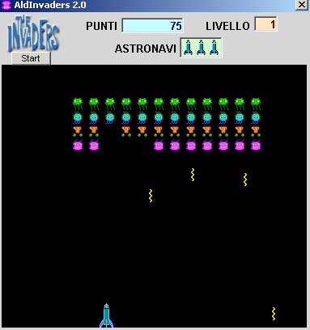

<div align="center">

## a \*\* PURE VB \*\* Space Invaders game


</div>

### Description

This a "pure VB" clone of the original Space invaders by TAITO. NO DirectX, NO Cheating, NO Wizards. ONLY pure VB who anyone can read and understand and... MODIFY!

Please RATE IT!
 
### More Info
 
keys to move:

simply the arrow keys .

To shot use space bar - or - UP arrow

It was only a Joke. I made the v1.0 in Qbasic in 1994, then here are the v2.0 in VB. It is not a complete game (no UFOs and no sound) but feel free to modify it.

I use it in my classes to demonstrate the use of object and collections in VB.


<span>             |<span>
---                |---
**Submitted On**   |2001-07-24 20:40:38
**By**             |[aldus](https://github.com/Planet-Source-Code/PSCIndex/blob/master/ByAuthor/aldus.md)
**Level**          |Intermediate
**User Rating**    |4.6 (83 globes from 18 users)
**Compatibility**  |VB 5\.0, VB 6\.0
**Category**       |[Games](https://github.com/Planet-Source-Code/PSCIndex/blob/master/ByCategory/games__1-38.md)
**World**          |[Visual Basic](https://github.com/Planet-Source-Code/PSCIndex/blob/master/ByWorld/visual-basic.md)
**Archive File**   |[a \_\_ PURE 234247242001\.zip](https://github.com/Planet-Source-Code/aldus-a-pure-vb-space-invaders-game__1-25435/archive/master.zip)

### API Declarations

```
none.
Only PURE VB
```


